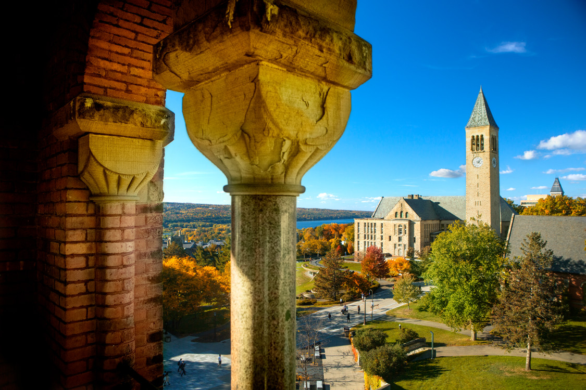
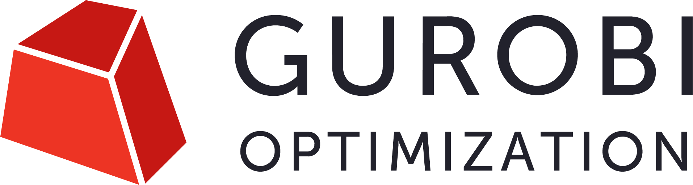
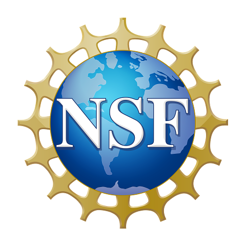
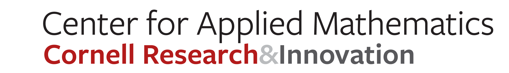
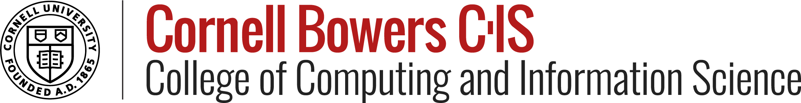

### June 8 &ndash; June 13, 2025; Cornell University &mdash; Ithaca, NY USA

The XXII Householder Symposium on Numerical Linear Algebra will be held June 8 - June 13, 2025 at the [Statler Hotel](https://statlerhotel.cornell.edu) on [Cornell University](https://www.cornell.edu/)'s campus in Ithaca, NY. The local organizing committee is [Anil Damle](mailto:damle@cornell.edu) (chair), [Alex Townsend](mailto:ajt253@cornell.edu), and [David Bindel](mailto:bindel@cornell.edu). The Householder Committee seeks a team to organize the 2028 Householder Symposium on Numerical Linear Algebra. The deadline for submitting a proposal is June 1, 2025. Details may be found [here](/organize).

#### Sponsors

Householder Symposium XXII gratefully acknowledges support from Mathworks, Gurobi, the National Science Foundation, the Cornell Ann S. Bowers College of Computing and Information Science, the Cornell Center for Applied Mathematics, and the Cornell Department of Mathematics

