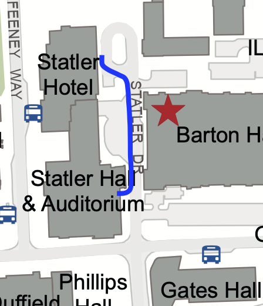

## Talks

Talks will be located in [Statler Hall](https://cornell.edu/short/y8d3t3h7). The welcome remarks and plenary sessions will be located in the Statler Auditorium. Parallel sessions will be held in the auditorium and Statler 196 and Statler 198. The entrance to all three rooms are located close to the Statler Dr. entrance to the building (see below) and signs inside the building can direct you to them.

While it is possible to get to Statler hall through the hotel, due to construction the easiest path is actually to exit the hotel through the main entrance and walk a short distance down Statler Drive to Statler Hall. Here is an illustration of the path:

## Posters

The poster 

## Coffee

Coffee breaks will take place in the atrium of [Statler Hall](https://cornell.edu/short/y8d3t3h7). Decent espresso may be found across the street at Gimme! Coffee located in [Gates Hall](https://cornell.edu/short/f9j9c2u8). They are open from 8 am till 3 pm.

## Meals

All meals will take place in the ballroom on the second floor of the Statler Hotel. There is signage through the hotel.

